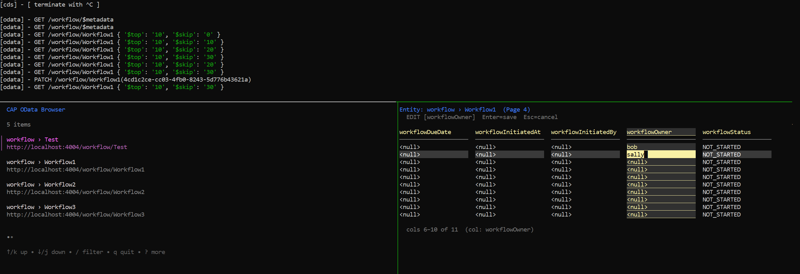

# CAP OData TUI



## Building

```bash
go build
```

## Usage

```bash
./cap_browser --version
```

```bash
./cap_browser --help
```

```bash
./cap_browser
```

```bash
./cap_browser -url http://localhost:4005
```

## Keys - Main Menu

Use the arrow keys to navigate, hit Enter to make a selection. Use `b` to exit program.

## Keys - Tables

- `r` - refresh data
- `k` - move up a row
- `j` - move down a row
- `h` - move left a column
- `l` - move right a column
- `n` - go to next page
- `p` - go to previous page
- `enter` - start editing cell (`esc` to back out, `enter` to `PATCH` data
- 'i' - insert new row
- 'x' - delete row
- `b` - back to main screen
